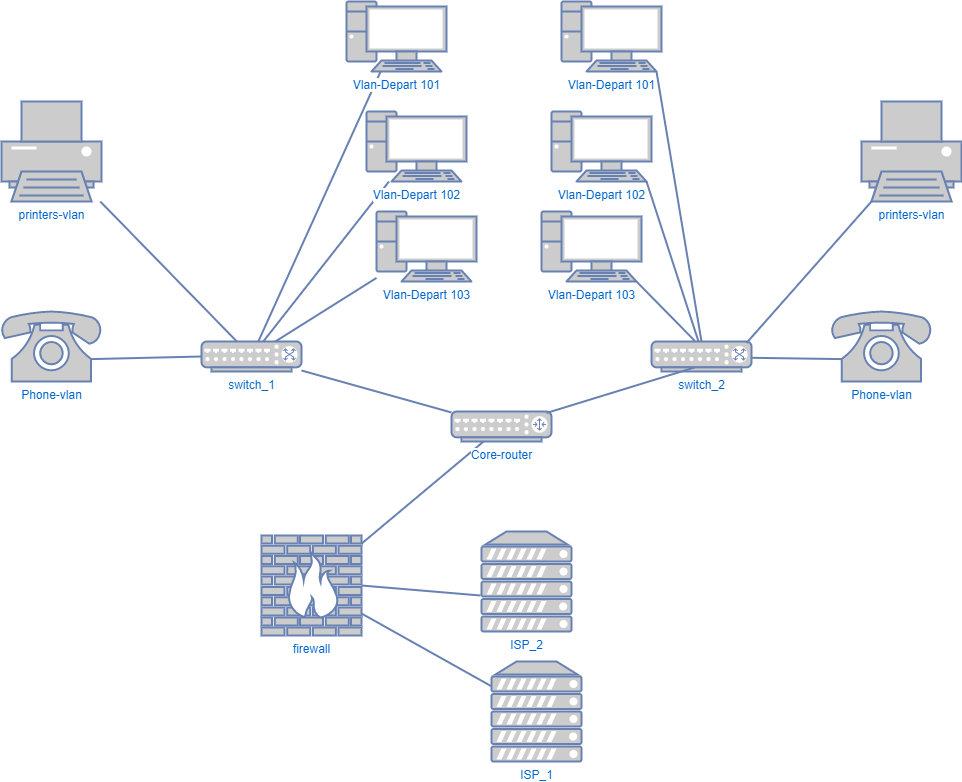

# Домашнее задание к занятию "3.8. Компьютерные сети, лекция 3"
1. show ip route 178.47.130.XXX  # с указанием префикса маски не работает 

        Routing entry for 178.47.128.0/20
          Known via "bgp 6447", distance 20, metric 10
          Tag 3257, type external
          Last update from 89.149.178.10 4d08h ago
          Routing Descriptor Blocks:
          * 89.149.178.10, from 89.149.178.10, 4d08h ago
              Route metric is 10, traffic share count is 1
              AS Hops 2
              Route tag 3257
              MPLS label: none
              
    show bgp 178.47.130.XXX # с указанием префикса маски не работает 
    
        BGP routing table entry for 178.47.128.0/20, version 1044866381
        Paths: (24 available, best #24, table default)
          Not advertised to any peer
          Refresh Epoch 1
          701 1273 12389
            137.39.3.55 from 137.39.3.55 (137.39.3.55)
              Origin IGP, localpref 100, valid, external
              path 7FE0FBF7ABB0 RPKI State valid
              rx pathid: 0, tx pathid: 0
          Refresh Epoch 1
          20912 3257 12389
            212.66.96.126 from 212.66.96.126 (212.66.96.126)
              Origin IGP, localpref 100, valid, external
              Community: 3257:4000 3257:8794 3257:50001 3257:50110 3257:54900 3257:54901 20912:65004
              path 7FE0B659D5E0 RPKI State valid
              rx pathid: 0, tx pathid: 0
          Refresh Epoch 1
          7660 2516 12389
            203.181.248.168 from 203.181.248.168 (203.181.248.168)
              Origin IGP, localpref 100, valid, external
              Community: 2516:1050 7660:9001
              path 7FE12E1664D8 RPKI State valid
              rx pathid: 0, tx pathid: 0
          Refresh Epoch 1
          3267 1299 12389
            194.85.40.15 from 194.85.40.15 (185.141.126.1)
              Origin IGP, metric 0, localpref 100, valid, external
              path 7FE0DE6BB830 RPKI State valid
              rx pathid: 0, tx pathid: 0
          Refresh Epoch 1
          53767 174 174 3356 12389
            162.251.163.2 from 162.251.163.2 (162.251.162.3)
              Origin IGP, localpref 100, valid, external
              Community: 174:21000 174:22013 53767:5000
              path 7FE11D58FD48 RPKI State valid
              rx pathid: 0, tx pathid: 0
          Refresh Epoch 1
          3356 12389
            4.68.4.46 from 4.68.4.46 (4.69.184.201)
              Origin IGP, metric 0, localpref 100, valid, external
              Community: 3356:2 3356:22 3356:100 3356:123 3356:501 3356:901 3356:2065
              path 7FE187559DB8 RPKI State valid
              rx pathid: 0, tx pathid: 0
          Refresh Epoch 1
          7018 3257 12389
            12.0.1.63 from 12.0.1.63 (12.0.1.63)
              Origin IGP, localpref 100, valid, external
              Community: 7018:5000 7018:37232
              path 7FE0ACA781D8 RPKI State valid
              rx pathid: 0, tx pathid: 0
          Refresh Epoch 1
          3549 3356 12389
            208.51.134.254 from 208.51.134.254 (67.16.168.191)
              Origin IGP, metric 0, localpref 100, valid, external
              Community: 3356:2 3356:22 3356:100 3356:123 3356:501 3356:901 3356:2065 3549:2581 3549:30840
              path 7FE141EDA8F0 RPKI State valid
              rx pathid: 0, tx pathid: 0
          Refresh Epoch 1
          101 3491 12389
            209.124.176.223 from 209.124.176.223 (209.124.176.223)
              Origin IGP, localpref 100, valid, external
              Community: 101:20300 101:22100 3491:400 3491:415 3491:9001 3491:9080 3491:9081 3491:9087 3491:62210 3491:62220
              path 7FE0B8B0A9C0 RPKI State valid
              rx pathid: 0, tx pathid: 0
          Refresh Epoch 1
          1221 4637 12389
            203.62.252.83 from 203.62.252.83 (203.62.252.83)
              Origin IGP, localpref 100, valid, external
              path 7FE18CCC01C8 RPKI State valid
              rx pathid: 0, tx pathid: 0
          Refresh Epoch 1
          3333 1103 12389
            193.0.0.56 from 193.0.0.56 (193.0.0.56)
              Origin IGP, localpref 100, valid, external
              path 7FE0F7F10658 RPKI State valid
              rx pathid: 0, tx pathid: 0
          Refresh Epoch 1
          57866 1299 12389
            37.139.139.17 from 37.139.139.17 (37.139.139.17)
              Origin IGP, metric 0, localpref 100, valid, external
              Community: 1299:30000 57866:100 57866:101 57866:501
              path 7FE03C429178 RPKI State valid
              rx pathid: 0, tx pathid: 0
          Refresh Epoch 1
          852 3491 12389
            154.11.12.212 from 154.11.12.212 (96.1.209.43)
              Origin IGP, metric 0, localpref 100, valid, external
              path 7FE0366BF218 RPKI State valid
              rx pathid: 0, tx pathid: 0
          Refresh Epoch 1
          20130 6939 12389
            140.192.8.16 from 140.192.8.16 (140.192.8.16)
              Origin IGP, localpref 100, valid, external
              path 7FE0D53B22C0 RPKI State valid
              rx pathid: 0, tx pathid: 0
          Refresh Epoch 2
          3303 12389
            217.192.89.50 from 217.192.89.50 (138.187.128.158)
              Origin IGP, localpref 100, valid, external
              Community: 3303:1004 3303:1006 3303:1030 3303:3056
              path 7FE0D80A2F88 RPKI State valid
              rx pathid: 0, tx pathid: 0
          Refresh Epoch 1
          3561 3910 3356 12389
            206.24.210.80 from 206.24.210.80 (206.24.210.80)
              Origin IGP, localpref 100, valid, external
              path 7FE02DE95D50 RPKI State valid
              rx pathid: 0, tx pathid: 0
          Refresh Epoch 4
          8283 1299 12389
            94.142.247.3 from 94.142.247.3 (94.142.247.3)
              Origin IGP, metric 0, localpref 100, valid, external
              Community: 1299:30000 8283:1 8283:101 8283:103
              unknown transitive attribute: flag 0xE0 type 0x20 length 0x24
                value 0000 205B 0000 0000 0000 0001 0000 205B
                      0000 0005 0000 0001 0000 205B 0000 0005
                      0000 0003
              path 7FE16B14ACD0 RPKI State valid
              rx pathid: 0, tx pathid: 0
          Refresh Epoch 1
          49788 12552 12389
            91.218.184.60 from 91.218.184.60 (91.218.184.60)
              Origin IGP, localpref 100, valid, external
              Community: 12552:12000 12552:12100 12552:12101 12552:22000
              Extended Community: 0x43:100:1
              path 7FE0E9FC50D8 RPKI State valid
              rx pathid: 0, tx pathid: 0
          Refresh Epoch 1
          4901 6079 3257 12389
            162.250.137.254 from 162.250.137.254 (162.250.137.254)
              Origin IGP, localpref 100, valid, external
              Community: 65000:10100 65000:10300 65000:10400
              path 7FE0F7305470 RPKI State valid
              rx pathid: 0, tx pathid: 0
          Refresh Epoch 1
          2497 12389
            202.232.0.2 from 202.232.0.2 (58.138.96.254)
              Origin IGP, localpref 100, valid, external
              path 7FE03E41CAC0 RPKI State valid
              rx pathid: 0, tx pathid: 0
          Refresh Epoch 1
          1351 6939 12389
            132.198.255.253 from 132.198.255.253 (132.198.255.253)
              Origin IGP, localpref 100, valid, external
              path 7FE186F878D8 RPKI State valid
              rx pathid: 0, tx pathid: 0
          Refresh Epoch 1
          19214 3257 12389
            208.74.64.40 from 208.74.64.40 (208.74.64.40)
              Origin IGP, localpref 100, valid, external
              Community: 3257:4000 3257:8794 3257:50001 3257:50110 3257:54900 3257:54901
              path 7FE0F121F930 RPKI State valid
              rx pathid: 0, tx pathid: 0
          Refresh Epoch 1
          6939 12389
            64.71.137.241 from 64.71.137.241 (216.218.252.164)
              Origin IGP, localpref 100, valid, external
              path 7FE0FF53CAA0 RPKI State valid
              rx pathid: 0, tx pathid: 0
          Refresh Epoch 1
          3257 12389
            89.149.178.10 from 89.149.178.10 (213.200.83.26)
              Origin IGP, metric 10, localpref 100, valid, external, best
              Community: 3257:4000 3257:8794 3257:50001 3257:50110 3257:54900 3257:54901
              path 7FE1472C7770 RPKI State valid
              rx pathid: 0, tx pathid: 0x0

1. ip a

        1: lo: <LOOPBACK,UP,LOWER_UP> mtu 65536 qdisc noqueue state UNKNOWN group default qlen 1000
            link/loopback 00:00:00:00:00:00 brd 00:00:00:00:00:00
            inet 127.0.0.1/8 scope host lo
               valid_lft forever preferred_lft forever
            inet6 ::1/128 scope host
               valid_lft forever preferred_lft forever
               
        ~~~~~~~~~~~~~~~~~~~~~~~~~~~~~~~~~~~~~~~~~~~~~~~~~~~~~~~~~~~~~~~
        
        5: dummy0: <BROADCAST,NOARP,UP,LOWER_UP> mtu 1500 qdisc noqueue state UNKNOWN group default qlen 1000
            link/ether 00:00:00:11:11:11 brd ff:ff:ff:ff:ff:ff
            inet 10.10.199.1/24 scope global dummy0
               valid_lft forever preferred_lft forever
            inet6 fe80::200:ff:fe11:1111/64 scope link

    sudo route add -net 8.8.4.4 netmask 255.255.255.255 metric 1024 dev dummy0  
    sudo route add -net 8.8.8.8 netmask 255.255.255.255 metric 1024 dev dummy0  
    route
    
        Kernel IP routing table
        Destination     Gateway         Genmask         Flags Metric Ref    Use Iface
        default         172.16.0.1      0.0.0.0         UG    0      0        0 ens192
        8.8.4.4         0.0.0.0         255.255.255.255 UH    1024   0        0 dummy0
        8.8.8.8         0.0.0.0         255.255.255.255 UH    1024   0        0 dummy0
        10.10.199.0     0.0.0.0         255.255.255.0   U     0      0        0 dummy0
        172.16.0.0      0.0.0.0         255.255.255.0   U     0      0        0 ens192
        172.17.0.0      0.0.0.0         255.255.0.0     U     0      0        0 docker0

1. Проверьте открытые TCP порты в Ubuntu.... Что считать открытым портом? Те что прослушиваются или которые открыты в iptables?  
  netstat -anp | grep tcp или  sudo lsof -iTCP -sTCP:LISTEN -P -n 
  
        COMMAND     PID            USER   FD   TYPE DEVICE SIZE/OFF NODE NAME
        systemd-r  1001 systemd-resolve   13u  IPv4  30780      0t0  TCP 127.0.0.53:53 (LISTEN)
        sshd       1231            root    3u  IPv4  36075      0t0  TCP *:22 (LISTEN)
        sshd       1231            root    4u  IPv6  36077      0t0  TCP *:22 (LISTEN)
        cupsd     64746            root    6u  IPv6 248594      0t0  TCP [::1]:631 (LISTEN)
        cupsd     64746            root    7u  IPv4 248595      0t0  TCP 127.0.0.1:631 (LISTEN)
        
        sshd - SSH сервер
        cupsd - служба печати 
        
1. 
        > sudo netstat -lnpu
        Active Internet connections (only servers)
        Proto Recv-Q Send-Q Local Address           Foreign Address         State       PID/Program name
        udp        0      0 0.0.0.0:59999           0.0.0.0:*                           1026/avahi-daemon:
        udp        0      0 0.0.0.0:5353            0.0.0.0:*                           1026/avahi-daemon:
        udp        0      0 127.0.0.53:53           0.0.0.0:*                           1001/systemd-resolv
        udp        0      0 0.0.0.0:631             0.0.0.0:*                           64748/cups-browsed
        udp6       0      0 :::58308                :::*                                1026/avahi-daemon:
        udp6       0      0 :::5353                 :::*                                1026/avahi-daemon:
        
        cups-browsed - служба печати
        systemd-resolv - системная служба кэширования DNS
        Avahi-daemon это система обеспечивающая обнаружение сервисов в локальной сети. 
        
1. 