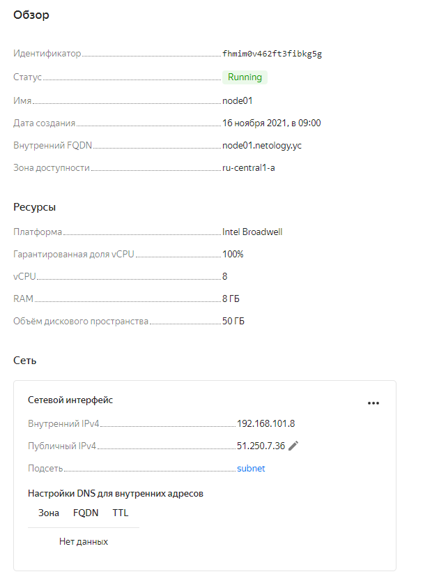
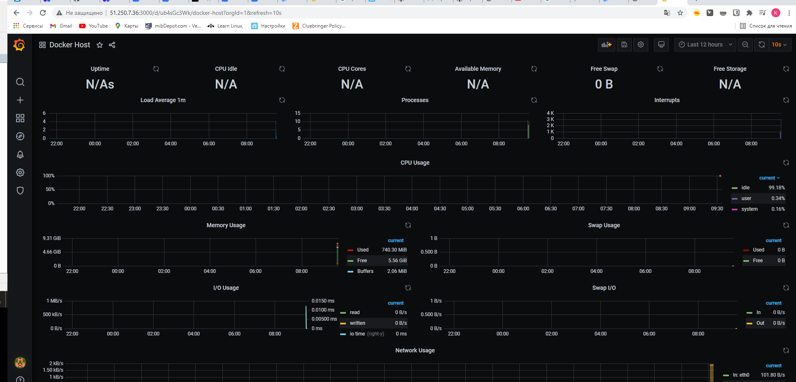
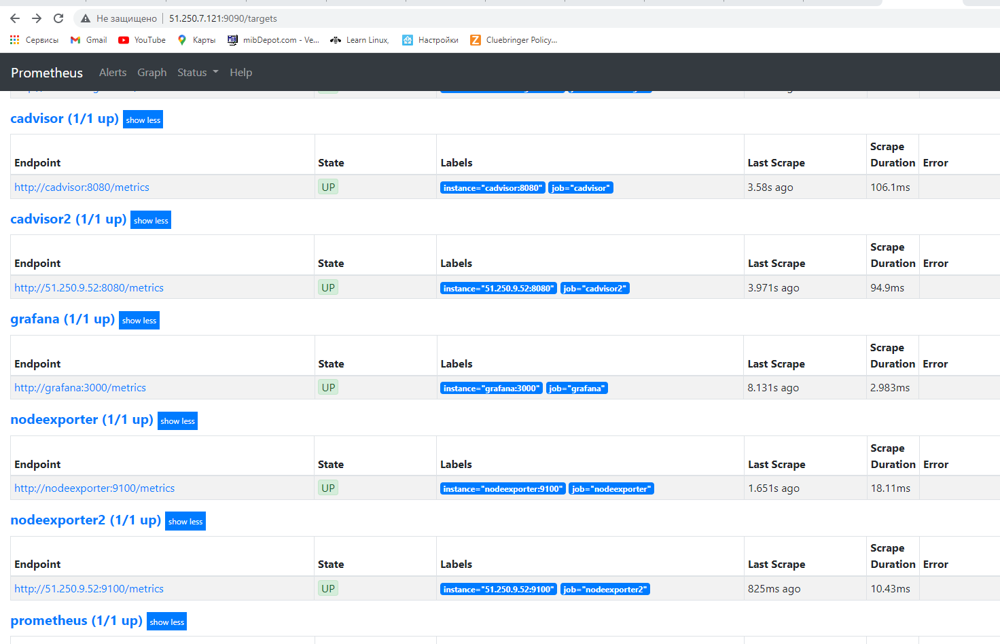

# Домашнее задание к занятию "5.4. Оркестрация группой Docker контейнеров на примере Docker Compose"

## Задача 1
```buildoutcfg
Build 'yandex' finished after 2 minutes 21 seconds.

==> Wait completed after 2 minutes 21 seconds

==> Builds finished. The artifacts of successful builds are:
--> yandex: A disk image was created: centos-7-base (id: fd86f5lfepm7och9v1lb) with family name centos
nposk@userver-1:~/packer$ yc compute image list
+----------------------+---------------+--------+----------------------+--------+
|          ID          |     NAME      | FAMILY |     PRODUCT IDS      | STATUS |
+----------------------+---------------+--------+----------------------+--------+
| fd86f5lfepm7och9v1lb | centos-7-base | centos | f2ebfhrshe5m6i4saf1j | READY  |
+----------------------+---------------+--------+----------------------+--------+

```

## Задача 2


## Задача 3
Данных нет, потому что случайно выключил машину до момента скриншота.


в связи с перезапуском виртуальной машины в облаке у нее изменился ip


## Задача 4
В prometheus контейнеры вижу, но не понимаю как их отобразить в графане 

