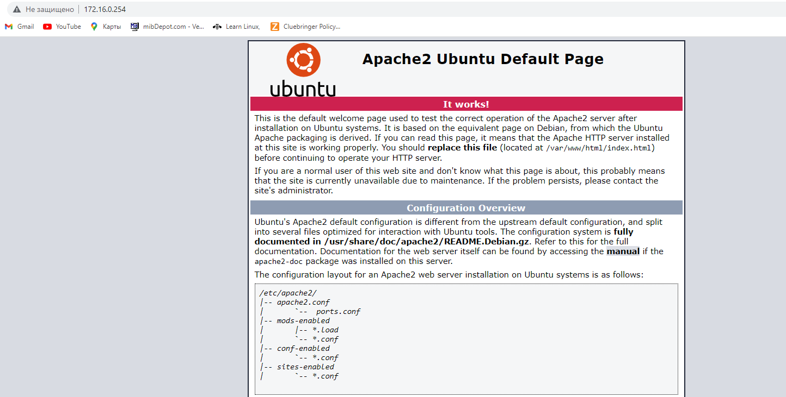
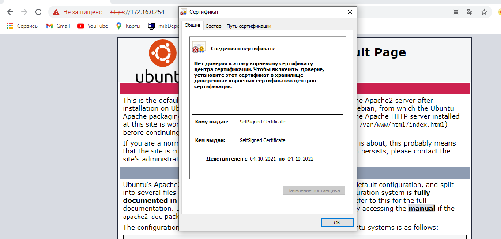
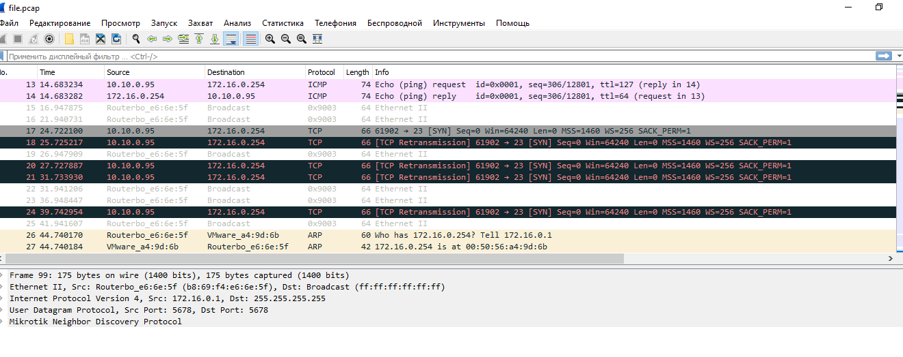

# Домашнее задание к занятию "3.9. Элементы безопасности информационных систем"

1. Зарегистрировался, установил.
1. Установил, настроил, проверил.
1. Без сертификата  
      
    С сертификатом
      
    
1. Проверка сайта https://permkrai.ru

         Start 2021-10-05 05:02:07        -->> 212.33.224.14:443 (permkrai.ru) <<--

         rDNS (212.33.224.14):   dial-up-224-14.perm.ertelecom.ru.
         Service detected:       HTTP
        
        
         Testing vulnerabilities
        
         Heartbleed (CVE-2014-0160)                not vulnerable (OK), no heartbeat extension
         CCS (CVE-2014-0224)                       not vulnerable (OK)
         Ticketbleed (CVE-2016-9244), experiment.  not vulnerable (OK)
         ROBOT                                     not vulnerable (OK)
         Secure Renegotiation (RFC 5746)           supported (OK)
         Secure Client-Initiated Renegotiation     not vulnerable (OK)
         CRIME, TLS (CVE-2012-4929)                not vulnerable (OK)
         BREACH (CVE-2013-3587)                    potentially NOT ok, "gzip" HTTP compression detected. - only supplied "/" tested
                                                   Can be ignored for static pages or if no secrets in the page
         POODLE, SSL (CVE-2014-3566)               not vulnerable (OK)
         TLS_FALLBACK_SCSV (RFC 7507)              Downgrade attack prevention supported (OK)
         SWEET32 (CVE-2016-2183, CVE-2016-6329)    not vulnerable (OK)
         FREAK (CVE-2015-0204)                     not vulnerable (OK)
         DROWN (CVE-2016-0800, CVE-2016-0703)      not vulnerable on this host and port (OK)
                                                   make sure you don't use this certificate elsewhere with SSLv2 enabled services
                                                   https://censys.io/ipv4?q=067B529EFE8910B663899011C1D15428625023777EC1C33833145A4DF0755405 could help you to find out
         LOGJAM (CVE-2015-4000), experimental      not vulnerable (OK): no DH EXPORT ciphers, no common prime detected
         BEAST (CVE-2011-3389)                     TLS1: ECDHE-RSA-AES128-SHA ECDHE-RSA-AES256-SHA DHE-RSA-AES128-SHA
                                                         DHE-RSA-AES256-SHA AES128-SHA AES256-SHA
                                                   VULNERABLE -- but also supports higher protocols  TLSv1.1 TLSv1.2 (likely mitigated)
         LUCKY13 (CVE-2013-0169), experimental     potentially VULNERABLE, uses cipher block chaining (CBC) ciphers with TLS. Check patches
         Winshock (CVE-2014-6321), experimental    not vulnerable (OK) - ARIA, CHACHA or CCM ciphers found
         RC4 (CVE-2013-2566, CVE-2015-2808)        no RC4 ciphers detected (OK)
        
        
         Done 2021-10-05 05:02:59 [  54s] -->> 212.33.224.14:443 (permkrai.ru) <<--

1.
        nposk@userver-1:/$ ll ~/.ssh
        total 28
        drwx------  2 nposk nposk 4096 Oct  4 05:43 ./
        drwxr-xr-x 22 nposk nposk 4096 Oct  5 04:55 ../
        -rw-r--r--  1 root  root    85 Oct  4 05:39 config
        -rw-------  1 nposk nposk 2602 Sep 28 08:49 id_rsa
        -rw-r--r--  1 nposk nposk  444 Sep 28 08:51 known_hosts
        -rw-------  1 nposk nposk 2602 Oct  4 05:43 suricata.key
        -rw-------  1 nposk nposk  569 Oct  4 05:43 suricata.pub

1.
        
        nposk@userver-1:/$ ssh suricata
        Activate the web console with: systemctl enable --now cockpit.socket
        
        Last login: Tue Oct  5 10:07:46 2021 from 172.16.0.254
        [root@suricata ~]#

1. [file.pcap](file.pcap)

1. nmap scanme.nmap.org
 
        nposk@userver-1:/$ nmap scanme.nmap.org
        Starting Nmap 7.91 ( https://nmap.org ) at 2021-10-05 05:12 UTC
        Nmap scan report for scanme.nmap.org (45.33.32.156)
        Host is up (0.21s latency).
        Other addresses for scanme.nmap.org (not scanned): 2600:3c01::f03c:91ff:fe18:bb2f
        Not shown: 996 closed ports
        PORT      STATE SERVICE
        22/tcp    open  ssh
        80/tcp    open  http
        9929/tcp  open  nping-echo
        31337/tcp open  Elite
        
        Nmap done: 1 IP address (1 host up) scanned in 9.69 seconds

1. UFW  
       
        nposk@userver-1:/$ sudo ufw status
        Status: active
        
        To                         Action      From
        --                         ------      ----
        OpenSSH                    ALLOW       Anywhere
        Apache                     ALLOW       Anywhere
        Apache Full                ALLOW       Anywhere
        Apache Secure              ALLOW       Anywhere
        OpenSSH (v6)               ALLOW       Anywhere (v6)
        Apache (v6)                ALLOW       Anywhere (v6)
        Apache Full (v6)           ALLOW       Anywhere (v6)
        Apache Secure (v6)         ALLOW       Anywhere (v6)

 