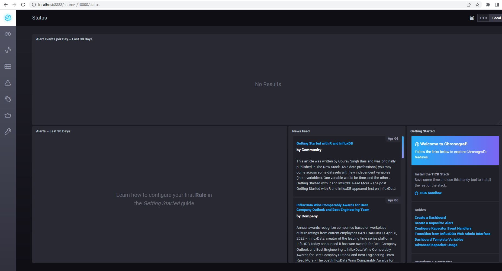
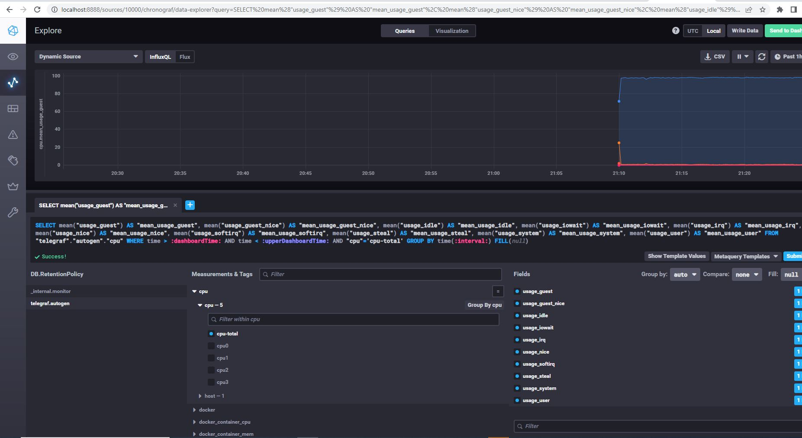
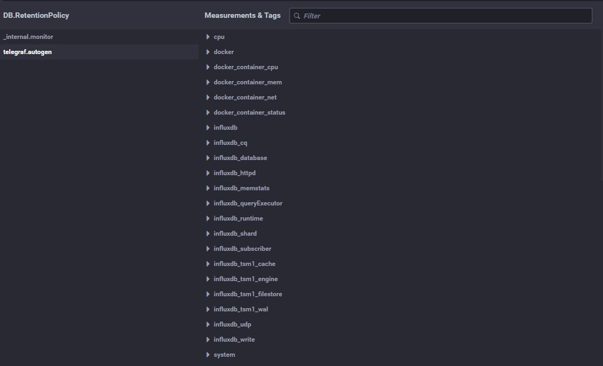

# ДЗ


1.  
    Push-модель:
        Упрощение репликации данных в разные системы мониторинга или их резервные копии 
        Более гибкая настройка отправки пакетов данных с  метриками 
        Большая скорость сбора метрик.
        Удобвно использовать в динамических инфраструктурах.
        Немного сложнее в тестировании сбора метрик.   
    Pull-модель:
        Единая точка настройки всех агентов   
        Подлинность получаемых данных   
        Возможность тестирования стандартными средствами.   
        Странно почему в лекции говорят про защищенность pull модели по сравнению с push. Шифрование возможна в обеих моделях.   
1.
    Prometheus - Pull & Push  
    TICK - Push  
    Zabbix - Pull  
    VictoriaMetrics - система в большей части для хранения метрик, а не для сбора.  
    Nagios - Pull  
1.   
    ```
    user@DESKTOP-S2PQFAK:~$ curl -sl -I localhost:8086/ping
    HTTP/1.1 204 No Content
    Content-Type: application/json
    Request-Id: afb5a3db-b5c4-11ec-808c-0242ac130003
    X-Influxdb-Build: OSS
    X-Influxdb-Version: 1.8.10
    X-Request-Id: afb5a3db-b5c4-11ec-808c-0242ac130003
    Date: Wed, 06 Apr 2022 16:14:50 GMT

    user@DESKTOP-S2PQFAK:~$ curl -sl -I localhost:8888
    HTTP/1.1 200 OK
    Accept-Ranges: bytes
    Cache-Control: public, max-age=3600
    Content-Length: 336
    Content-Security-Policy: script-src 'self'; object-src 'self'
    Content-Type: text/html; charset=utf-8
    Etag: "3362220244"
    Last-Modified: Tue, 22 Mar 2022 20:02:44 GMT
    Vary: Accept-Encoding
    X-Chronograf-Version: 1.9.4
    X-Content-Type-Options: nosniff
    X-Frame-Options: SAMEORIGIN
    X-Xss-Protection: 1; mode=block
    Date: Wed, 06 Apr 2022 16:14:52 GMT

    user@DESKTOP-S2PQFAK:~$ curl -sl -I localhost:9092/kapacitor/v1/ping
    HTTP/1.1 204 No Content
    Content-Type: application/json; charset=utf-8
    Request-Id: beff2b32-b5c4-11ec-8052-000000000000
    X-Kapacitor-Version: 1.6.4
    Date: Wed, 06 Apr 2022 16:15:16 GMT

    ```
    
 

1.  

1.   
