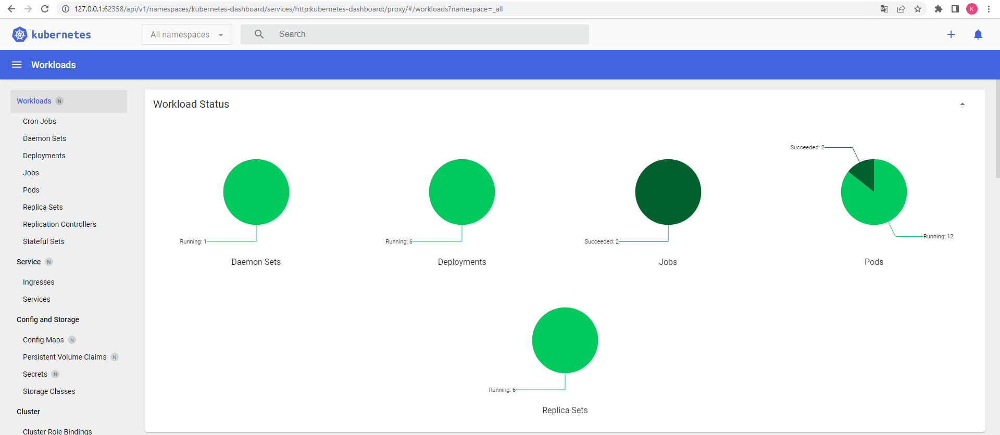

## Домашнее задание к занятию "12.1 Компоненты Kubernetes"
1.   
  
1. 
  ``` 
  PS C:\minikube> kubectl create deployment hello-node --image=k8s.gcr.io/echoserver:1.4
PS C:\minikube> kubectl get deployments
NAME         READY   UP-TO-DATE   AVAILABLE   AGE
hello-node   0/1     1            0           12s

PS C:\minikube> kubectl get pods
NAME                          READY   STATUS    RESTARTS   AGE
hello-node-6b89d599b9-rqb5f   1/1     Running   0          66s
NAME         READY   UP-TO-DATE   AVAILABLE   AGE
hello-node   1/1     1            1           73s

PS C:\minikube> kubectl expose deployment hello-node --type=LoadBalancer --port=8080
service/hello-node exposed

PS C:\minikube> kubectl get services
NAME         TYPE           CLUSTER-IP   EXTERNAL-IP   PORT(S)          AGE
kubernetes   ClusterIP      10.96.0.1    <none>        443/TCP          4m18s


PS C:\minikube> .\minikube.exe service hello-node
❗  Executing "docker container inspect minikube --format={{.State.Status}}" took an unusually long time: 3.4070366s
💡  Restarting the docker service may improve performance.
🏃  Starting tunnel for service hello-node.
🎉  Opening service default/hello-node in default browser...
❗  Because you are using a Docker driver on windows, the terminal needs to be open to run it.
✋  Stopping tunnel for service hello-node.
PS C:\minikube> .\minikube.exe service hello-node
❗  Executing "docker container inspect minikube --format={{.State.Status}}" took an unusually long time: 2.144882s
💡  Restarting the docker service may improve performance.
🏃  Starting tunnel for service hello-node.
🎉  Opening service default/hello-node in default browser...
❗  Because you are using a Docker driver on windows, the terminal needs to be open to run it.
✋  Stopping tunnel for service hello-node.


PS C:\minikube> .\minikube.exe addons list
|-----------------------------|----------|--------------|--------------------------------|
|         ADDON NAME          | PROFILE  |    STATUS    |           MAINTAINER           |
|-----------------------------|----------|--------------|--------------------------------|
| ambassador                  | minikube | disabled     | third-party (ambassador)       |
| auto-pause                  | minikube | disabled     | google                         |
| csi-hostpath-driver         | minikube | disabled     | kubernetes                     |
| default-storageclass        | minikube | enabled ✅   | kubernetes                     |
| efk                         | minikube | disabled     | third-party (elastic)          |
| freshpod                    | minikube | disabled     | google                         |
| gcp-auth                    | minikube | disabled     | google                         |
| gvisor                      | minikube | disabled     | google                         |
| helm-tiller                 | minikube | disabled     | third-party (helm)             |
| ingress                     | minikube | disabled     | unknown (third-party)          |
| ingress-dns                 | minikube | disabled     | google                         |
| istio                       | minikube | disabled     | third-party (istio)            |
| istio-provisioner           | minikube | disabled     | third-party (istio)            |
| kong                        | minikube | disabled     | third-party (Kong HQ)          |
| kubevirt                    | minikube | disabled     | third-party (kubevirt)         |
| logviewer                   | minikube | disabled     | unknown (third-party)          |
| metrics-server              | minikube | disabled     | kubernetes                     |
| nvidia-driver-installer     | minikube | disabled     | google                         |
| olm                         | minikube | disabled     | third-party (operator          |
|                             |          |              | framework)                     |
| pod-security-policy         | minikube | disabled     | unknown (third-party)          |
| portainer                   | minikube | disabled     | portainer.io                   |
| registry                    | minikube | disabled     | google                         |
| registry-aliases            | minikube | disabled     | unknown (third-party)          |
| registry-creds              | minikube | disabled     | third-party (upmc enterprises) |
| storage-provisioner         | minikube | enabled ✅   | google                         |
| storage-provisioner-gluster | minikube | disabled     | unknown (third-party)          |
|-----------------------------|----------|--------------|--------------------------------|
PS C:\minikube> .\minikube.exe addons enable metrics-server
❗  Executing "docker container inspect minikube --format={{.State.Status}}" took an unusually long time: 2.1428143s
💡  Restarting the docker service may improve performance.
    ▪ Используется образ k8s.gcr.io/metrics-server/metrics-server:v0.4.2
🌟  The 'metrics-server' addon is enabled

PS C:\minikube> kubectl get pod,svc -n kube-system
NAME                                   READY   STATUS    RESTARTS        AGE
pod/coredns-64897985d-w9rxs            1/1     Running   0               10m
pod/etcd-minikube                      1/1     Running   0               10m
pod/kube-controller-manager-minikube   1/1     Running   0               10m
pod/kube-proxy-dqgft                   1/1     Running   0               10m
pod/kube-scheduler-minikube            1/1     Running   0               10m
pod/metrics-server-6b76bd68b6-8bvfl    1/1     Running   0               20s
pod/storage-provisioner                1/1     Running   1 (9m46s ago)   10m

service/kube-dns         ClusterIP   10.96.0.10       <none>        53/UDP,53/TCP,9153/TCP   10m
service/metrics-server   ClusterIP   10.111.232.100   <none>        443/TCP                  20s


PS C:\minikube> kubectl get pod
hello-node-6b89d599b9-rqb5f   1/1     Running   0          7m49s
PS C:\minikube> .\minikube.exe addons enable ingress
❗  Executing "docker container inspect minikube --format={{.State.Status}}" took an unusually long time: 2.1314469s
💡  After the addon is enabled, please run "minikube tunnel" and your ingress resources would be available at "127.0.0.1"
    ▪ Используется образ k8s.gcr.io/ingress-nginx/kube-webhook-certgen:v1.1.1
    ▪ Используется образ k8s.gcr.io/ingress-nginx/controller:v1.1.1
    ▪ Используется образ k8s.gcr.io/ingress-nginx/kube-webhook-certgen:v1.1.1
🔎  Verifying ingress addon...
🌟  The 'ingress' addon is enabled
PS C:\minikube> .\minikube.exe addons enable dashboard
❗  Executing "docker container inspect minikube --format={{.State.Status}}" took an unusually long time: 2.1542166s
💡  Restarting the docker service may improve performance.
    ▪ Используется образ kubernetesui/metrics-scraper:v1.0.7
    ▪ Используется образ kubernetesui/dashboard:v2.3.1
💡  Some dashboard features require the metrics-server addon. To enable all features please run:

        minikube addons enable metrics-server


🌟  The 'dashboard' addon is enabled


PS C:\minikube> .\minikube.exe service hello-node
❗  Executing "docker container inspect minikube --format={{.State.Status}}" took an unusually long time: 2.141955s
🏃  Starting tunnel for service hello-node.
🎉  Opening service default/hello-node in default browser...
❗  Because you are using a Docker driver on windows, the terminal needs to be open to run it.
✋  Stopping tunnel for service hello-node.


PS C:\minikube> kubectl config view
clusters:
- cluster:
    certificate-authority: C:\Users\User\.minikube\ca.crt
    - extension:
        last-update: Tue, 31 May 2022 21:55:02 +05
        provider: minikube.sigs.k8s.io
      name: cluster_info
    server: https://127.0.0.1:49627
  name: minikube
contexts:
- context:
    cluster: minikube
    extensions:
    - extension:
        last-update: Tue, 31 May 2022 21:55:02 +05
        provider: minikube.sigs.k8s.io
        version: v1.25.2
      name: context_info
current-context: minikube
kind: Config
preferences: {}
users:
- name: minikube
  user:
    client-certificate: C:\Users\User\.minikube\profiles\minikube\client.crt
    client-key: C:\Users\User\.minikube\profiles\minikube\client.key
    
PS C:\minikube> kubectl get services
NAME         TYPE           CLUSTER-IP       EXTERNAL-IP   PORT(S)          AGE
hello-node   LoadBalancer   10.103.185.163   <pending>     8080:32102/TCP   8s
kubernetes   ClusterIP      10.96.0.1        <none>        443/TCP          25m
PS C:\minikube> kubectl get services
NAME         TYPE           CLUSTER-IP       EXTERNAL-IP   PORT(S)          AGE
hello-node   LoadBalancer   10.103.185.163   <pending>     8080:32102/TCP   57s
kubernetes   ClusterIP      10.96.0.1        <none>        443/TCP          25m

  ```
  
